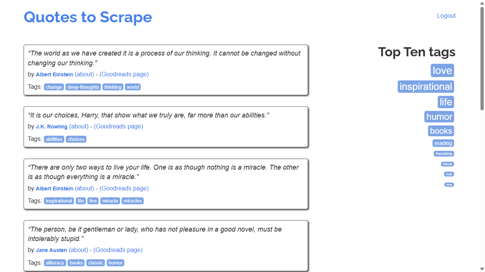

# Browser Login Automation with Playwright

## Objective
This project is a clean and focused demonstration of the ability to automate a web browser to perform a user login and access a secure, members-only area. This is a critical skill for scraping data that is not publicly visible.

## Core Technologies
- **Python**
- **Playwright:** Used to launch and control a browser, fill form fields (username, password), click the submit button, and verify the result.

## Key Features & Proof of Work
- **Authentication Handling:** Successfully automates the entire login sequence on the `quotes.toscrape.com` sandbox.
- **Login Verification:** After submitting the form, the script programmatically verifies a successful login by waiting for an element that *only* exists on the post-login page (the "Logout" link).
- **Proof of Success:** The script automatically generates the following screenshot of the authenticated area after a successful login:

